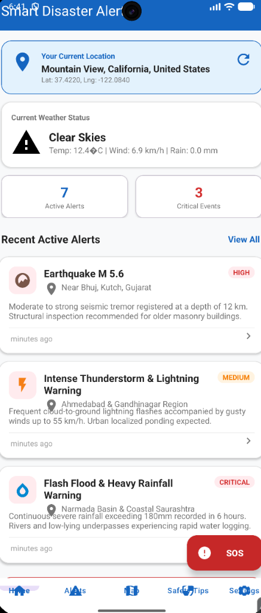
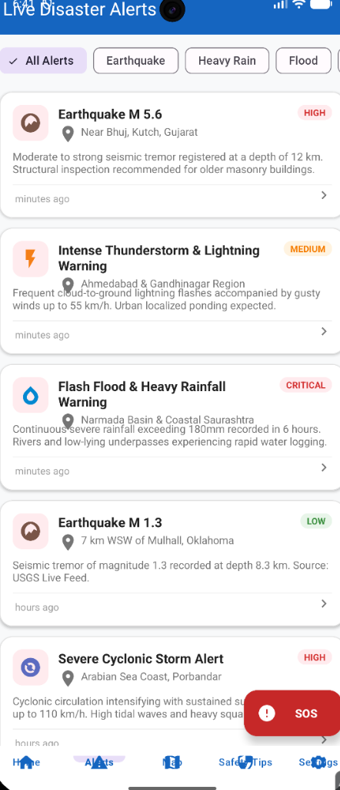
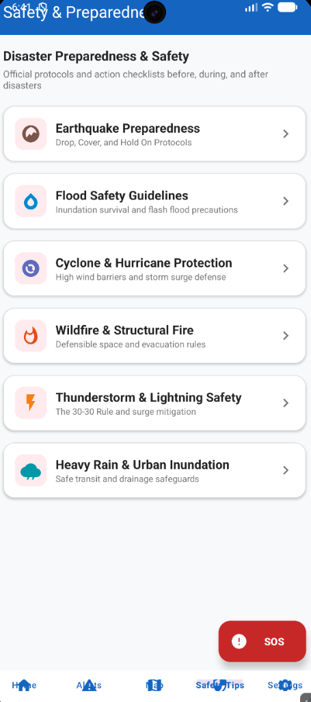

# 🚨 Smart Disaster Alert App

[](https://developer.android.com/)
[](https://kotlinlang.org/)
[](https://m3.material.io/)
[](https://developer.android.com/topic/architecture)
[](LICENSE)

A production-ready, native Android application engineered in **Kotlin** for real-time disaster early-warnings, meteorological hazard tracking, location-based risk assessment, and rapid emergency response. Developed as a 1-month comprehensive capstone for the **Mobile Application Development (MAD)** curriculum.

---

## 👨‍💻 Developer & Academic Information

| Field | Detail |
|---|---|
| **Author / Developer** | **Prince Patel** |
| **GitHub Profile** | [@Prince100107](https://github.com/Prince100107) |
| **Enrollment Number** | **24012011120** |
| **Course** | Mobile Application Development (MAD) |
| **Project Duration** | 1 Month (Aug 16, 2026 – Sep 15, 2026) |
| **Minimum SDK** | API 24 (Android 7.0 Nougat) |
| **Target SDK** | API 36 (Android 15+) |

---

## 📱 Application Screenshots Showcase

| 🏠 Home Dashboard | 📋 Live Disaster Alerts | 🗺️ Disaster Impact Zones |
|:---:|:---:|:---:|
|  |  |  |
| Real-time GPS location, weather, and critical alert stats | Categorized multi-hazard feed with severity filtering | Interactive disaster impact coordinates & Google Maps intents |

| 📖 Safety & Preparedness | ⚙️ App Preferences | 🆘 Emergency SOS Center | 🔍 Alert Details |
|:---:|:---:|:---:|:---:|
|  |  |  |  |
| Actionable survival checklists for 6 disaster categories | Custom severity thresholds and notification toggles | Instant 1-tap emergency dialer (112, 1070) & GPS SMS | In-depth casualty report, guidelines & navigation link |

---

## 🌟 What This Application Does

**Smart Disaster Alert App** acts as an intelligent personal safety companion and early warning radar. It continuously monitors geological and meteorological threat feeds, assesses proximity hazards against the user's live physical location, and equips users with one-tap emergency response tools during crisis scenarios.

### Core Capabilities:
1. **Multi-Hazard Threat Detection**:
   Monitors six critical natural disaster categories:
   * 🌎 **Earthquakes**: Real-time seismic activity with Richter scale magnitude, focal depth, and epicenter location.
   * 🌊 **Floods & Inundations**: River basin surges, dam overflow warnings, and flash flooding risks.
   * 🌪️ **Cyclones & Hurricanes**: Coastal storm trackers, sustained wind velocity, and storm surge warnings.
   * 🔥 **Wildfires & Forest Fires**: Hotspot identification, smoke hazard alerts, and perimeter expansion reports.
   * ⚡ **Severe Thunderstorms**: Lightning strike density, squall warnings, and urban wind hazard advisories.
   * 🌧️ **Heavy Precipitation**: Extreme rainfall accumulation rates (mm/hr) and drainage capacity overload warnings.

2. **Automated Location & Meteorological Sync**:
   * Leverages Android's `FusedLocationProviderClient` to identify the user's exact geographical coordinates.
   * Employs reverse geocoding via Android `Geocoder` to display human-readable locality and state names.
   * Seamlessly queries the Open-Meteo REST API for live ambient temperature, wind velocity, precipitation intensity, and atmospheric conditions without requiring any paid API key.

3. **Multi-Tier Severity Classification**:
   Every disaster event is normalized into an industry-standard severity hierarchy:
   * 🟢 **LOW**: Informational tremors and moderate meteorological alerts.
   * 🟡 **MEDIUM**: Advisory conditions requiring heightened caution and readiness.
   * 🟠 **HIGH**: Significant hazards with potential structural damage or transit disruptions.
   * 🔴 **CRITICAL**: Immediate life-threatening events triggering visual SOS alerts and system notifications.

4. **Rapid-Action Emergency SOS Center**:
   Accessible from anywhere in the application via a persistent high-contrast floating emergency button:
   * **1-Tap Direct Helpline Calling**: Instant implicit intent dispatch to **112** (National Unified Emergency), **1070** (Disaster Management Authority), **108** (Medical Ambulance), **100** (Police), and **101** (Fire Rescue).
   * **Automated SOS SMS Generator**: Compiles an urgent SOS distress message with the user's real-time GPS coordinates and a clickable Google Maps location pin, pre-loaded into Android's native SMS application.
   * **Universal Location Broadcast**: Shares live coordinates across WhatsApp, Telegram, or any messaging channel via Android Sharesheet.

5. **Disaster Impact Zones & Maps**:
   * Visualizes all active calamity centers alongside the user's current position.
   * Includes direct deep-linking into Google Maps (`geo:lat,lon?q=...`) for one-tap turn-by-turn navigation or evacuation route planning.

6. **Survival & Preparedness Protocols**:
   * Interactive, offline-available safety manuals detailing structured **Before, During, and After** survival procedures for each natural hazard.

7. **Notification & Preference Controls**:
   * Integrated with Android Notification Channels (`disaster_alerts_channel`) with High Importance priority.
   * Configurable minimum severity thresholds (Show All, Medium+, High Only) stored persistently in `SharedPreferences`.

---

## 🏗️ Architecture & Engineering Design

The project follows Google's recommended **MVVM (Model-View-ViewModel)** architectural pattern, prioritizing separation of concerns, testability, and responsiveness:

```
                  ┌─────────────────────────────────────┐
                  │              UI LAYER               │
                  │   Activities, Fragments & Adapters  │
                  └──────────────────┬──────────────────┘
                                     │ Observes LiveData / User Events
                                     ▼
                  ┌─────────────────────────────────────┐
                  │           VIEWMODEL LAYER           │
                  │  MainViewModel (AndroidViewModel)   │
                  └──────────────────┬──────────────────┘
                                     │ Coroutine Dispatchers (IO)
                                     ▼
                  ┌─────────────────────────────────────┐
                  │          REPOSITORY LAYER           │
                  │          DisasterRepository         │
                  └─────────┬─────────────────┬─────────┘
                            │                 │
              ┌─────────────▼──────┐   ┌──────▼─────────────┐
              │     REMOTE DATA    │   │     LOCAL DATA     │
              │  Retrofit 2 REST   │   │  AppPreferences    │
              │  - USGS GeoJSON    │   │  (SharedPreferences│
              │  - Open-Meteo      │   │  & Offline Mock)   │
              └────────────────────┘   └────────────────────┘
```

### Technical Highlights:
* **Zero-Setup Live Data Strategy**: USGS Earthquakes GeoJSON feed and Open-Meteo Weather APIs operate key-free, ensuring the project builds and runs immediately on any development environment without external credentials.
* **Resilient Offline Architecture**: If internet connectivity is lost or network timeout expires (3-second threshold), the repository gracefully falls back to cached records, ensuring zero UI freezes or blank states.
* **Lightweight Build Engine**: Uses standard AndroidX libraries and Material 3 without heavy C++ native mapping overhead, providing blazing fast Gradle builds (< 10 seconds).
* **Robust Shared ViewModel**: Built using `AndroidViewModel(application)` so that `MainActivity` and all four navigation fragments (`HomeFragment`, `AlertsFragment`, `MapFragment`, `SettingsFragment`) share the exact same reactive state cleanly without recreation overhead.

---

## 🧰 Technology Stack & Tools

* **Language**: [Kotlin](https://kotlinlang.org/) (100% Native)
* **Target OS**: Android 7.0 (API 24) to Android 15 (API 36)
* **Build System**: Gradle 9.4.1 with Android Gradle Plugin (AGP) 9.2.1
* **UI Toolkit**: Material Design 3 (`com.google.android.material:material`)
* **Architecture Components**:
  * `ViewModel` & `AndroidViewModel`
  * `LiveData` & `MutableLiveData`
  * `ViewBinding` for type-safe XML manipulation
* **Asynchronous Programming**: Kotlin Coroutines (`Dispatchers.IO`, `viewModelScope`)
* **Networking & Parsing**:
  * [Retrofit 2.11.0](https://square.github.io/retrofit/)
  * [Gson Converter](https://github.com/google/gson)
  * [OkHttp 4.12.0](https://square.github.io/okhttp/)
* **Hardware & System Services**:
  * Google Play Services Location (`FusedLocationProviderClient`)
  * Android System `Geocoder`
  * Android `NotificationManager` & `NotificationChannel`
  * Android System Intents (`ACTION_DIAL`, `ACTION_SENDTO`, `ACTION_VIEW`)
  * `SharedPreferences` for user configurations

---

## 📂 Project Structure

```
SmartDisasterAlertApp/
├── app/
│   ├── src/main/
│   │   ├── AndroidManifest.xml           # System permissions & activity declarations
│   │   ├── java/com/example/smartdisasteralert/
│   │   │   ├── SmartDisasterApp.kt       # Application class & notification channels
│   │   │   ├── data/
│   │   │   │   ├── api/                  # Retrofit API clients & service interfaces
│   │   │   │   ├── local/                # SharedPreferences & offline data source
│   │   │   │   ├── model/                # Data classes, enums (Severity, DisasterType)
│   │   │   │   └── repository/           # Unified disaster repository with network fallback
│   │   │   ├── ui/
│   │   │   │   ├── splash/               # Animated splash screen
│   │   │   │   ├── main/                 # MainActivity & MainViewModel
│   │   │   │   ├── home/                 # Dashboard fragment & weather summary
│   │   │   │   ├── alerts/               # Filterable disaster alert feed & adapter
│   │   │   │   ├── map/                  # Disaster impact coordinates & map zones
│   │   │   │   ├── tips/                 # Actionable disaster preparedness guides
│   │   │   │   ├── details/              # In-depth disaster alert report activity
│   │   │   │   └── emergency/            # Emergency SOS bottom sheet dialog
│   │   │   └── utils/                    # LocationHelper, NotificationHelper, DateTimeUtils
│   │   └── res/
│   │       ├── drawable/                 # 24+ vector icons for hazards, severity & UI
│   │       ├── layout/                   # Clean, responsive XML layouts with ViewBinding
│   │       ├── menu/                     # Bottom navigation bar menu items
│   │       └── values/                   # Material 3 colors, strings, themes (Day/Night)
│   └── build.gradle.kts                  # App-level build configurations & dependencies
├── screenshots/                          # Real app screenshots & visual UI output
├── build.gradle.kts                      # Project-level build script
└── settings.gradle.kts                   # Dependency repositories & plugin management
```

---

## 🚀 Getting Started & Installation

### Prerequisites
* **Android Studio**: Ladybug / Hedgehog / Jellyfish or newer.
* **Java Development Kit (JDK)**: JDK 17 or JDK 21 / 25 configured in Android Studio.
* **Android Device or Emulator**: API 24+ with Google Play Services enabled for location.

### Step-by-Step Setup
1. **Clone the Repository**:
   ```bash
   git clone https://github.com/Prince100107/SmartDisasterAlertApp.git
   cd SmartDisasterAlertApp
   ```

2. **Open in Android Studio**:
   * Launch Android Studio.
   * Select **Open an Existing Project** and navigate to `SmartDisasterAlertApp`.
   * Allow Gradle to sync dependencies (takes under 1 minute).

3. **Build the Debug APK**:
   ```bash
   ./gradlew assembleDebug
   ```
   The compiled APK will be generated at:
   `app/build/outputs/apk/debug/app-debug.apk`

4. **Run the Application**:
   * Connect your physical Android smartphone with USB debugging enabled, or start an Android Virtual Device (AVD).
   * Click the green **Run (▶)** button in Android Studio toolbar.
   * Grant location and notification permissions when prompted to enable real-time hazard detection for your region.

---

## 📈 1-Month Development Journey

This project was built over 1 month of structured, progressive iterations:

* **Week 1 (Aug 16 – Aug 22)**: Project foundation, Gradle setup, Material 3 theming, core disaster models, and offline dataset.
* **Week 2 (Aug 23 – Aug 29)**: Bottom navigation architecture, Home dashboard layout, RecyclerView adapters, and SOS floating action trigger.
* **Week 3 (Aug 30 – Sep 05)**: Retrofit 2 REST API integration (USGS Earthquakes GeoJSON + Open-Meteo Weather) and Emergency Response Center.
* **Week 4 (Sep 06 – Sep 12)**: GPS Location integration with `FusedLocationProviderClient`, Geocoding, Impact Zones, and Notification Channels.
* **Final Polish (Sep 13 – Sep 15)**: Performance optimizations, ViewModel shared architecture stabilization, screenshot documentation, and production readiness.

---

## 📄 License
This project is licensed under the **MIT License** — feel free to use and adapt this project for educational and academic purposes.
